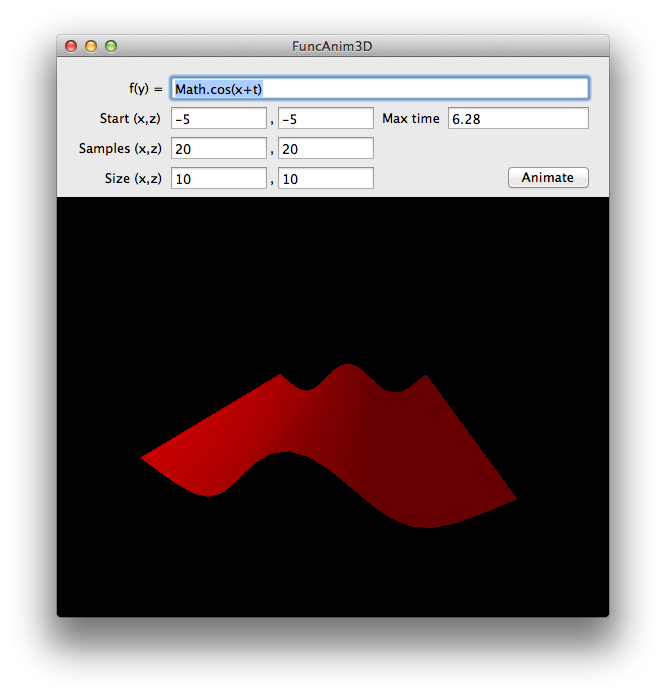

# FuncAnim3D

This is a simple Mac application which allows you to animate 3D graphs in Cartesian coordinates.

FuncAnim3D allows you completely control over how your function is drawn. You are provided with a simple `y=` prompt, where you can enter JavaScript code. Your code will be called for many ordered pairs `(x, z)`, and your code's return value is treated as `y`.

When you use the *animate* feature, an additional variable is passed into your code called `t`. This variable ranges from 0 to whatever you set as the maximum time, and will loop back to 0 after it reaches said maximum.

### Examples

I highly recommend you try graphing y=`Math.cos(x+t)` with a maximum time of `6.2831853072` seconds. This should be a cool waving plane.

